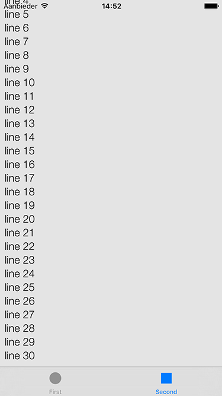

Cordova iOS - step 4
====================
Tweaking the WebView

## Take control!
- In Xcode open `<YourAppName>/Main.storyboard`
- Select the ViewController in the `Second scene` again and change the `Custom class` back from `CDVViewController` to `SecondViewController`
- Now open `SecondViewController.h` and make the class implement `CDVViewController` instead of `UIViewController`
- You'll need to add an import to make everything compile correctly again: `#import <Cordova/CDVViewController.h>`

Run the app and you shouldn't see anything different than the previous step, but this change gives us more control over how the webview is embedded, read on.. 

## Fixing the WebView height
To accomodate for the native tab bar we'll shrink the WebView a bit:

- Open `SecondViewController.m` and add this method:

```objective-c
- (void)viewWillAppear:(BOOL)animated
{
  CGRect viewBounds = self.view.bounds;
  CGFloat tabBarHeight = self.tabBarController.tabBar.frame.size.height;
  CGRect webViewBounds = CGRectMake(viewBounds.origin.x,
                                    viewBounds.origin.y,
                                    viewBounds.size.width,
                                    viewBounds.size.height - tabBarHeight);

  self.webView.frame = webViewBounds;
  self.webView.backgroundColor = [UIColor clearColor];

  [super viewWillAppear:animated];
}
```

## Check the result
Run the app, select the second tab, and scroll down - you should now see this:

