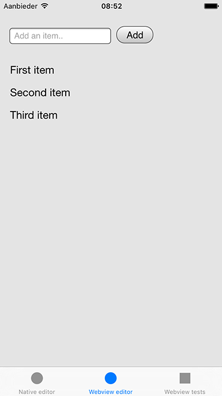

Cordova iOS - step 5
====================
Adding a custom plugin for web-native communication

__This is a lot of stuff so you might want to just grab the code folder instead of following along__

When these steps have been completed you'll end up with this:


## Let's add a plugin
We'll do this one manually (as opposed to using CocoaPods) as that's also useful to learn.

- In Xcode right-click your project (top left) and select `New Group`, call it `cordova-plugin-pgdayeu16`
- Right-click that new folder and click `New file...`, select `iOS` > `Source` > `Header File`, name it `PGDayEU16Plugin.h` and paste these contents:

```objective-c
#import <Cordova/CDVPlugin.h>

@interface PGDayEU16Plugin : CDVPlugin

- (void) retrieveList:(CDVInvokedUrlCommand*)command;
- (void) addToList:(CDVInvokedUrlCommand*)command;

@end
```

- Right-click the folder again and click `New file...`, select `iOS` > `Source` > `Objective-C File`, name it `PGDayEU16Plugin.m` (select your app's target when asked!) and paste these contents:

```objective-c
#import "PGDayEU16Plugin.h"

static NSString *const kPluginOptionItem = @"item";

@implementation PGDayEU16Plugin

- (void) retrieveList:(CDVInvokedUrlCommand*)command {
  NSDictionary * items = nil; // TODO get native list

  CDVPluginResult * pluginResult = [CDVPluginResult resultWithStatus:CDVCommandStatus_OK messageAsDictionary:items];
  [self.commandDelegate sendPluginResult:pluginResult callbackId:command.callbackId];
}

- (void) addToList:(CDVInvokedUrlCommand*)command {
  NSDictionary * args = [command.arguments objectAtIndex:0];
  NSString * item = args[kPluginOptionItem];
  if (item == nil) {
    CDVPluginResult * pluginResult = [CDVPluginResult resultWithStatus:CDVCommandStatus_ERROR messageAsString:@"item is required"];
    [self.commandDelegate sendPluginResult:pluginResult callbackId:command.callbackId];
    return;
  }
  // TODO add item to native list

  CDVPluginResult * pluginResult = [CDVPluginResult resultWithStatus:CDVCommandStatus_OK];
  [self.commandDelegate sendPluginResult:pluginResult callbackId:command.callbackId];
}

@end
```

- Go to `Pods` > `phonegap-ios-template` > `Resources` and open `config.xml`, then add this somewhere near the other `<feature>` tags:

```xml
    <feature name="PGDayEU16Plugin">
      <param name="ios-package" value="PGDayEU16Plugin" />
    </feature>
```

- Go to `Pods` > `phonegap-ios-template` > `Resources` > `www` and open `cordova_plugins.js`, then add this to the top:
```js
        {
            "file": "plugins/cordova-plugin-pgdayeu16/www/PGDayEU16Plugin.js",
            "id": "cordova-plugin-pgdayeu16.PGDayEU16Plugin",
            "pluginId": "cordova-plugin-pgdayeu16",
            "clobbers": [
                "window.PGDayEU16Plugin"
            ]
        },
```

You have now added the Cordova plugin native files, the JS bridge and the necessary wiring, bravo!

## Let's use the plugin
The plugin has two functions: `retrieveList` and `addToList`.

For both web and native we will create a view with an input field and a list and the idea is to sync those lists.

The current native ViewController will become the native editor, for the web editor we'll add a third tab.

- Right-click your app and click `New file...`, select `iOS` > `Source` > `Header File`, name it `CordovaListEditorViewController.h` and paste these contents:

```objective-c
#import <UIKit/UIKit.h>
#import <Cordova/CDVViewController.h>

@interface CordovaListEditorViewController : CDVViewController

@end
```
- Right-click the folder again and click `New file...`, select `iOS` > `Source` > `Objective-C File`, name it `CordovaListEditorViewController.m` (select your app's target when asked!) and paste these contents:

```objective-c
#import "CordovaListEditorViewController.h"

@interface CordovaListEditorViewController ()

@end

@implementation CordovaListEditorViewController

- (void)viewDidLoad {
  // we don't want the default "index.html" for this ViewController
  [self setStartPage:@"listeditor.html"];
  [super viewDidLoad];
  // Do any additional setup after loading the view, typically from a nib.
}

- (void)viewWillAppear:(BOOL)animated
{
  CGRect viewBounds = self.view.bounds;
  CGFloat tabBarHeight = self.tabBarController.tabBar.frame.size.height;
  CGRect webViewBounds = CGRectMake(viewBounds.origin.x,
                                    viewBounds.origin.y,
                                    viewBounds.size.width,
                                    viewBounds.size.height - tabBarHeight);

  self.webView.frame = webViewBounds;
  self.webView.backgroundColor = [UIColor clearColor];

  [super viewWillAppear:animated];
}

- (void)didReceiveMemoryWarning {
  [super didReceiveMemoryWarning];
  // Dispose of any resources that can be recreated.
}

@end
```

- Add a tab by opening `Main.storyboard` and dragging a `ViewController` onto the canvas
- Hold the `ctrl` key and drag from the 'Tab Bar Controller' to the new ViewController - that should add a new tab bar item
- Select the new Scene you added and change the `Custom class` to `CordovaListEditorViewController` (which you just added)
- Copy the [shared www folder](../www-shared) over `Pods` > `phonegap-ios-template` > `Resources` > `www`, overriding any files already there


__FINISH__

You made it - When you now run the app you should have 3 tabs and a working list editor which syncs between web and native!




If you want to add some sugar and learn more, [continue to step 6](../step6-adding-a-webview-loading-indicator) :)