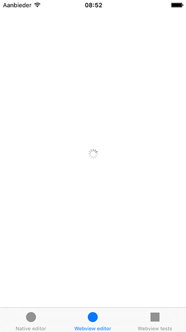

Cordova iOS - step 6
====================
Adding a Webview loading indicator

## Lol wut?
A Cordova-only app has the luxury of a splashscreen to hide the fact the webview is warming up.
Both the webview itself and any JS/CSS/DOM painting will be hidden by the splashscreen.

A fully native app may also need to preload some assets and possibly remote data so it often also
utilizes a splashscreen to hide this warm-up period.

In an embedded scenario however the webview is likely not the first view your app will load,
so upon loading a webview your app needs a little time to get ready. Especially on Android btw.
And it gets worse if you load large JS libs like AngularJS.

To simulate a heavy webview JS payload we can add a simple function like this:

```js
// artificial delay to show why a native loading indicator may make sense
for (var i = 0; i < 500000000; i++) {
}
```

We can hide this warm-up by adding a loading indicator.

## Adding a loading indicator
- Open `CordovaListEditorViewController.m` and add this property at the top between `@interface` and `@end`:

```objective-c
@property (nonatomic, strong) UIActivityIndicatorView *spinnerView;
```

- Add this at the end of the `viewDidLoad` method:

```objective-c
  // configure a loading indicator; show here, and hide when CDVPageDidLoadNotification fires
  [[NSNotificationCenter defaultCenter] addObserver:self
                                           selector:@selector(hideLoadingIndicator:)
                                               name:CDVPageDidLoadNotification
                                             object:nil];

  [self showLoadingIndicator];
```

- Add these methods:

```objective-c
- (void)showLoadingIndicator
{
  self.spinnerView = [[UIActivityIndicatorView alloc]initWithActivityIndicatorStyle:UIActivityIndicatorViewStyleGray];
  const CGFloat spinnerSize = 30;
  //Position the spinner on screen's center taking the tabbar into account.
  CGRect viewBounds = self.view.bounds;
  CGFloat tabBarHeight = self.tabBarController.tabBar.frame.size.height;
  self.spinnerView.frame = CGRectMake(roundf((viewBounds.size.width - spinnerSize) / 2),
                                      roundf((viewBounds.size.height - spinnerSize - tabBarHeight) / 2),
                                      spinnerSize,
                                      spinnerSize);
  self.spinnerView.autoresizingMask = UIViewAutoresizingFlexibleTopMargin | UIViewAutoresizingFlexibleBottomMargin| UIViewAutoresizingFlexibleLeftMargin| UIViewAutoresizingFlexibleRightMargin;
  [self.view addSubview:self.spinnerView];
  self.spinnerView.hidesWhenStopped = YES;
  [self.spinnerView startAnimating];
}

- (void)hideLoadingIndicator:(NSNotification*)notification
{
  [self.spinnerView stopAnimating];
}
```

